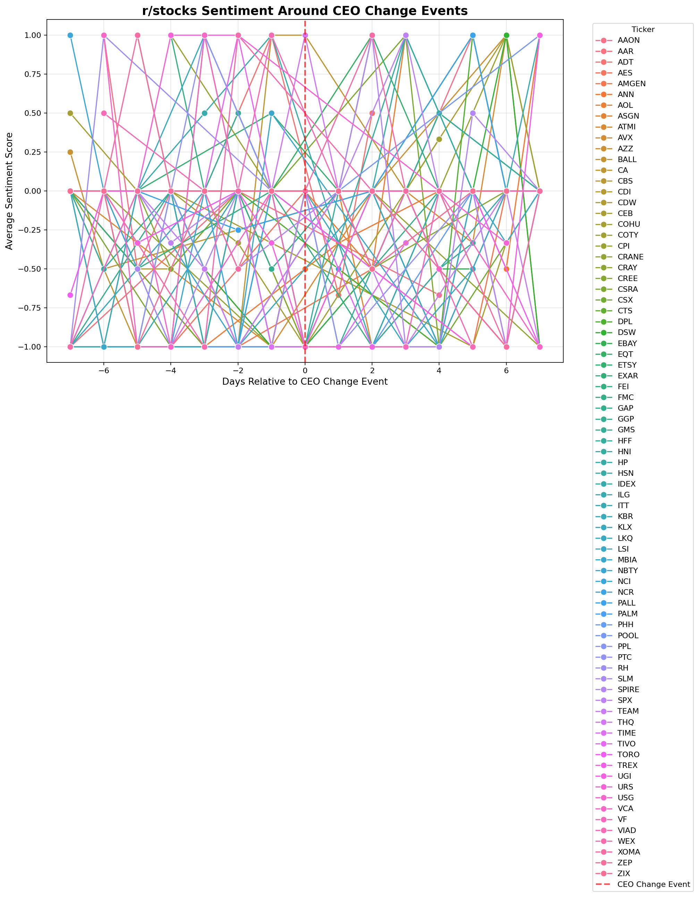

# CEO Resignation – Reddit Sentiment Analysis

WIP 

Tracks r/stocks sentiment ±7 days around leadership changes.

> Post-period coef = −0.12 (p < 0.05) – Reddit turns negative after CEOs step down.
