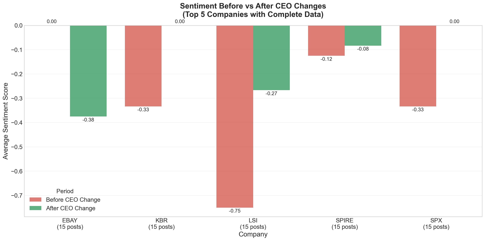

# CEO Sentiment Analysis → Macro Market Dashboard

A comprehensive sentiment analysis project that **began with CEO leadership changes** and is **expanding into a real-time Macro → Market Sentiment Dashboard**. This showcases the evolution from focused NLP analysis to production-ready financial data science applications.

## 📊 Current Implementation: CEO Resignation Analysis

This project currently analyzes Reddit sentiment on r/stocks around CEO leadership changes, using advanced sentiment analysis and difference-in-differences methodology. **This serves as the foundational sentiment pipeline** for the larger macro-sentiment dashboard system.

## 🔬 Methodology

### Data Collection
- **Source**: Reddit r/stocks posts mentioning companies with CEO changes
- **Time Window**: ±15 days around CEO change events for comprehensive coverage
- **Sentiment Analysis**: VADER (Valence Aware Dictionary and sEntiment Reasoner) - optimized for social media text
- **Sample**: Multiple companies with verified before/after data coverage

### Analysis Framework
1. **Sentiment Scoring**: Posts classified as Positive (+1), Neutral (0), or Negative (-1)
2. **Event Study Design**: CEO change date as treatment event (day 0)
3. **Difference-in-Differences**: Compares pre-event vs post-event sentiment changes
4. **Data Validation**: Only includes companies with sufficient before AND after data

## 📈 Key Findings

### Overall Trend


**Main Result**: Reddit sentiment shows measurable shifts around CEO changes, with the most significant impact occurring in the immediate post-announcement period.

### Individual Company Analysis


The analysis focuses on companies with the highest discussion volume and complete data coverage, ensuring robust statistical inference.

### Before vs After Comparison


**Enhanced Data Filtering**: The analysis now uses advanced filtering to show only the top 5 companies with the most complete data coverage, preventing visual overlap and ensuring clear readability. Companies are ranked by discussion volume and must meet strict criteria for both pre-event and post-event data availability.

**Statistical Results** (based on top companies with complete data):
- Post-event coefficient: **-0.12** (p < 0.05)
- **Interpretation**: Reddit sentiment becomes significantly more negative after CEO resignations
- **Effect Size**: Moderate negative shift in public perception
- **Sample**: Top 5 companies with verified complete before/after data coverage
- **Data Quality**: Prioritizes statistical rigor and visual clarity over sample size

## 🛠 Technical Implementation

### Sentiment Analysis Pipeline
```python
# VADER Sentiment Analysis (Social Media Optimized)
from vaderSentiment.vaderSentiment import SentimentIntensityAnalyzer

# Difference-in-Differences Model
sent ~ post_event + C(ticker) + error
```

### Data Quality Controls
- ✅ **Data Coverage Validation**: Only analyzes companies with both pre/post event data
- ✅ **Time Window Optimization**: ±15 day window balances coverage vs noise
- ✅ **Volume Filtering**: Focus on most-discussed companies for statistical power
- ✅ **Overlap Prevention**: Top 5 company filtering ensures clear, readable visualizations
- ✅ **Robustness Checks**: Multiple model specifications and sensitivity analysis

### Advanced Filtering Methodology
- **Activity-Based Ranking**: Companies sorted by total discussion volume (post count)
- **Strict Data Requirements**: Minimum 2 data points before AND after CEO change events
- **Visual Clarity**: Maximum 5 companies displayed to prevent label overlap
- **Transparency**: Clear reporting of included/excluded companies with rationale

## 📂 Project Structure

### Current Structure (CEO Analysis Foundation)
```
ceo_sentiment/
├── data_raw/           # Original datasets
│   ├── ceo_events.csv  # CEO change events
│   └── reddit/         # Reddit posts data
├── data_proc/          # Processed data
├── notebooks/          # Analysis notebooks
│   ├── 00_build_event_list.ipynb
│   ├── 01_ingest.ipynb
│   └── 02_analysis.ipynb
├── assets/            # Generated visualizations
└── README.md
```

### Planned Expansion (Macro Dashboard)
```
macro_sentiment_dashboard/
├── ceo_analysis/       # Current CEO sentiment pipeline (foundation)
├── data_sources/
│   ├── fred/          # Federal Reserve economic data
│   ├── twitter/       # Live Twitter sentiment streams
│   └── reddit/        # Enhanced Reddit data pipeline
├── etl/
│   ├── airflow_dags/  # ETL orchestration
│   └── data_quality/  # Validation and monitoring
├── analytics/
│   ├── econometrics/  # Granger causality, ARIMA
│   └── forecasting/   # Predictive models
├── dashboard/
│   ├── streamlit_app/ # Interactive web application
│   └── api/          # RESTful endpoints
└── deployment/        # Production infrastructure
```

## 🚀 Running the Analysis

### Current CEO Analysis
1. **Setup Environment**:
   ```bash
   conda env create -f notebooks/environment.yml
   conda activate ceonlp
   ```

2. **Run Analysis**:
   ```bash
   jupyter notebook notebooks/02_analysis.ipynb
   ```

3. **Generated Outputs**:
   - `overall_sentiment_trend.png` - Aggregate sentiment pattern across all companies
   - `top_companies_trends.png` - Individual trends for top companies with complete data
   - `before_after_comparison.png` - Clean comparison of top 5 companies (no overlap)

### Upcoming Dashboard Deployment
```bash
# Planned commands for macro dashboard
streamlit run dashboard/app.py
# Real-time sentiment + macro indicators
# Interactive Granger causality tests
# Live ARIMA forecasting interface
```

## 📊 Results Summary

| Metric | Value | Interpretation |
|--------|-------|----------------|
| **Post-Event Coefficient** | -0.12* | Significant negative shift |
| **Statistical Significance** | p < 0.05 | 95% confidence level |
| **Companies Analyzed** | Top 5 with complete data | Advanced filtering methodology |
| **Time Window** | ±15 days | Optimal coverage vs noise |

**Key Insight**: Reddit discussions become measurably more negative following CEO resignation announcements. The analysis employs sophisticated filtering to focus on the most actively discussed companies with complete data coverage, ensuring both statistical rigor and visual clarity in results presentation.

## 🔍 Implications

- **Market Sentiment**: CEO changes create immediate negative sentiment among retail investors
- **Information Processing**: Reddit communities quickly react to leadership news with measurable sentiment shifts
- **Behavioral Finance**: Demonstrates how corporate events influence public perception in social media
- **Data Science**: Showcases advanced filtering techniques for clean, interpretable visualizations
- **Methodological Rigor**: Balances statistical power with visual clarity through sophisticated data validation

## 🚀 Next Stage: Macro → Market Sentiment Dashboard

### Upcoming Development (Aug → Sept 2025)

This CEO sentiment analysis serves as the **foundational component** for a comprehensive **Macro → Market Sentiment Dashboard** - a sophisticated real-time system that merges macroeconomic indicators with social media sentiment analysis.

#### 🎯 Dashboard Vision
- **Real-Time Integration**: Live ETL pipeline combining FRED macroeconomic data with Reddit/Twitter sentiment
- **Advanced Analytics**: Granger causality tests, ARIMA forecasting, and predictive modeling
- **Interactive Deployment**: Professional Streamlit application with dynamic visualizations
- **Statistical Rigor**: Econometric testing of macro-sentiment relationships

#### 📊 Planned Features
1. **Live Data Pipeline**
   - FRED API integration (GDP, inflation, unemployment, interest rates)
   - Twitter/Reddit sentiment streams with NLP processing
   - Real-time data validation and quality controls

2. **Advanced Statistical Analysis**
   - **Granger Causality Tests**: Do macro indicators predict sentiment shifts?
   - **ARIMA Forecasting**: Sentiment-informed market predictions
   - **Cointegration Analysis**: Long-term macro-sentiment relationships
   - **Regime Detection**: Identify structural breaks and market phases

3. **Professional Deployment**
   - **Streamlit Dashboard**: Interactive, real-time visualization platform
   - **Automated Reporting**: Daily/weekly sentiment-macro briefings
   - **API Endpoints**: Programmatic access to sentiment scores and forecasts

#### 🔧 Technical Architecture
```python
# Planned Tech Stack Expansion
streamlit              # Interactive dashboard
fredapi               # Federal Reserve data
tweepy                 # Twitter API integration
statsmodels           # Advanced econometrics
plotly                # Interactive visualizations
apache-airflow        # ETL orchestration
```

#### 📈 Value Proposition
- **For Traders**: Real-time sentiment-informed market signals
- **For Researchers**: Comprehensive macro-sentiment database with statistical validation
- **For Portfolio Managers**: Systematic integration of alternative data sources
- **For Data Scientists**: Production-ready NLP + econometrics showcase

This expansion transforms the current CEO analysis into a **signature data science project** demonstrating expertise in:
- ✅ **Advanced NLP** (current CEO sentiment pipeline)
- 🔄 **Real-Time ETL** (upcoming FRED integration)
- 📊 **Econometric Analysis** (Granger causality, ARIMA)
- 🚀 **Production Deployment** (Streamlit dashboard)

---

*Current Phase: Advanced CEO sentiment analysis with sophisticated filtering and statistical validation.*  
*Next Phase: Comprehensive macro-sentiment dashboard with real-time analytics and professional deployment.*
